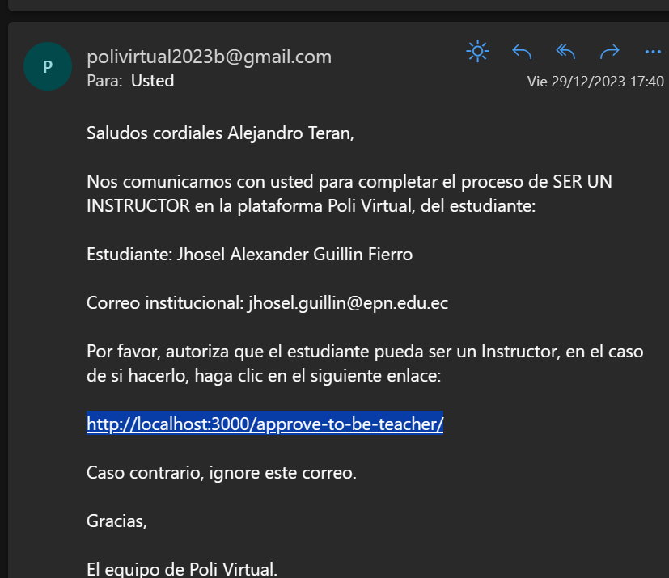

## Primer paso:
- Antes de ejecutar el backend, ejecuta los siguientes comandos dentro de /backend/app/:
- El comando git pull no se debe ejecutar si ya hiciste pull desde GITHUB-DESKTOP.
```bash
git pull
python .\manage.py makemigrations
python .\manage.py migrate
```
- Si no salen errores, sigue con el paso 2, caso contrario escribeme al Whatsapp.

## Segundo paso:
- Consume los 4 siguientes endpoints desde el frontend:
```bash
path('user/contact-with-us/', views.contact_with_us, name='user-contact-with-us'), # Contact with us

path('user/be-an-instructor/', views.be_an_instructor, name='user-be-an-instructor'), # Be an instructor

path('user/featured-teachers/', views.featured_teachers, name='user-featured-teachers'), # Get featured teachers

path('user/send-email-to-approve-teacher/', views.send_email_to_approve_teacher, name='user-sned-email-to-approve-teacher'), # Send email to approve teacher
```

## Consumir en el siguiente orden:
- Endpoint /user/contact-with-us/:
```bash
# Para consumir de manera correcta este endpoint debes utilizar un metodo POST y debes enviar un JSON bajo este formato:

{
  "name": "Alexander Guillin",
  "email": "jhosel.guillin@epn.edu.ec",
  "message": "Hola tengo un problema con mis cursos, no se muestran de manera correcta"
}
```
- Endpoint /user/featured-teachers/:
```bash
# Para consumir de manera correcta este endpoint debes utilizar un metodo GET y no es necesario enviar el token ni parametros, solo directo la ruta del endpoint.

# NOTA: Para que te devuelva algo, es necesario en la BD de mongo que en el nuevo campo de score_teacher, coloques un numero >= 4.0, dado que se puso como condicion que solo devuelva los instructores con esa puntuacion.
```
- Endpoint /user/send-email-to-approve-teacher/:
```bash
# Para utilizar este endpoint debe utilizar un metodo PUT, debes enviar el token en la cabecera de AUTHORIZATION y en el body, se debe enviar un JSON de este tipo:

{
  "approve_teacher": "Alejandro Teran",
  "approve_teacher_email": "alexanderguillin1999@gmail.com"
}

Por eso este metodo debes implementarlo en http://localhost:3000/common/be-instructor, la cual es una ruta del frontend, cuando el usuario llene los campos: "Profesor que te aprueba" y "Correo del profesor" y este de clic en "Enviar correo", debes llamar a este endpoint.

# Luego es necesario crear una vista en el frontend que tenga la siguiente ruta:

http://localhost:3000/approve-to-be-teacher/

# Esta vista puede ser similar a la que se creo cuando el usuario verifica su correo electronico, pero el mensaje debe cambiar, la logica de esta vista es que cuando un usuario decida ser un instructor, le va a llegar un correo al profesor que le aprueba, con el siguiente formato:
```


```bash
# En el caso que el profesor decida dar clic, es decir aprobar al estudiante como instructor dentro de la nueva vista creada se debe llamar al último endpoint /user/be-an-instructor/.
```
- Endpoint /user/be-an-instructor/:
```bash
# Para utilizar este endpoint es necesario utilizar un metodo PUT y enviar en la cabecera el token (AUTHORIZATION) y nada mas.
```
. NOTA: Si todo esta bien en cada endpoint se regresa un status 200, caso contrario me avisas al Whatsapp.
